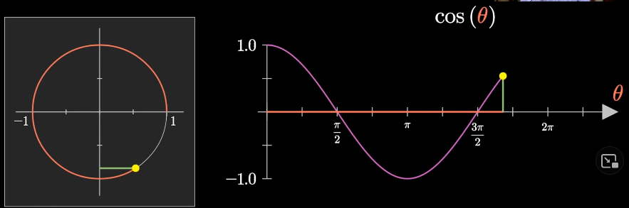
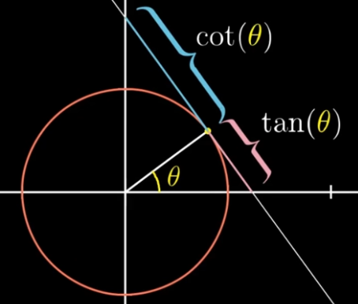

# 3Blue1Brown's Lockdown Math

Notes from [3Blue1Brown's Lockdown Math](https://www.youtube.com/playlist?list=PLZHQObOWTQDP5CVelJJ1bNDouqrAhVPev) YouTube live lectures.

Uses `Markdown + Math` VSCode extension.

Resource: LATEX Math [cheatsheet](http://tug.ctan.org/info/undergradmath/undergradmath.pdf).

- [3Blue1Brown's Lockdown Math](#3blue1browns-lockdown-math)
  - [Key takeaways](#key-takeaways)
  - [Pedagogy](#pedagogy)
  - [1: The simpler quadratic formula](#1-the-simpler-quadratic-formula)
    - [The product as a difference of squares](#the-product-as-a-difference-of-squares)
    - [Factoring quadratics](#factoring-quadratics)
    - [Sum of squares](#sum-of-squares)
  - [2: Trigonometry fundamentals](#2-trigonometry-fundamentals)
    - [Walking around the unit circle](#walking-around-the-unit-circle)
    - [Converting between Triangle-trig and Circle-trig](#converting-between-triangle-trig-and-circle-trig)
      - [Tangent](#tangent)
    - [Pythagorean theorem](#pythagorean-theorem)
    - [Squared (co)sines](#squared-cosines)
  - [3: Complex number fundamentals](#3-complex-number-fundamentals)
    - [Assumptions for complex numbers](#assumptions-for-complex-numbers)
    - [Operations on complex numbers](#operations-on-complex-numbers)
    - [Linearly algebraic representation of complex numbers](#linearly-algebraic-representation-of-complex-numbers)
    - [Rotation](#rotation)
      - [Trigonometric angle sum identities](#trigonometric-angle-sum-identities)
    - [Complex numbers and Polynomials](#complex-numbers-and-polynomials)
      - [Complex numbers and Euler](#complex-numbers-and-euler)
    - [Fun facts about imaginary and complex numbers](#fun-facts-about-imaginary-and-complex-numbers)

## Key takeaways

1. There are different ways to represent the same data. Learn connections between different representations to solve problems efficiently.
2. If you don't know of some of the representations of problems, their solutions look like magic.
3. When faced with a new formula, try graphing it (ex. [Desmos](https://www.desmos.com/calculator)).
4. When faced with trig, try drawing various circles and triangles.
5. [GeoGebra](https://www.geogebra.org/calculator) is a good visual tool for representing algebra geometrically and vise versa.

## Pedagogy

1. Live multiple-choice questions: when writing them, make note of what errors would cause incorrect choices. Once answers come in, look at the distribution of responses and comment on likely sources of error. Help students fail forward and thus benefit from having tried answering.

## 1: The simpler quadratic formula

### The product as a difference of squares
Every product of 2 numbers $r, s$ can be represented as a difference of squares.
$$
rs = (m-d)(m+d) \\
   = m^2 - d^2
$$
$m,d$ are the average and standard deviation, respectively.
$$
m = (r+s)/2 \\
d = |m - r| = |m - s|
$$

### Factoring quadratics
Any $f(x) = ax^2 - bx + c$ can be factored into an equivalent representation $f(x) = (x-r)(x-s)$. The roots $r,s$ are the values of x for which $f(x) = y = 0$. Thus they represent coordinates for the intersection of the parabola with the $x$-axis.

Setting $f(x) = 0$:
$$
0 = (x-r)(x-s) \\
= ax^2 - bx + c \\
= x^2 - \frac{b}{a}x + \frac{c}{a} \\
= x^2 - \frac{r+s}{a} + \frac{rs}{a}
$$

From the definition of the average:
$$
r,s = m \pm d = m \pm \sqrt{m^2 - p}
$$
where
$$
m = \frac{r+s}{2} = -\frac{b}{2a} \\
p = rs = \frac{c}{a}
$$

### Sum of squares
Using complex numbers, every sum of squares $m^2 + d^2$ can be expressed as a difference of squares, and thus factored:
$$
m^2 + d^2 \\
= m^2 - (-1)d^2 \\
= m^2 - i^2d^2 \\
= (m + id)(m - id) \\
$$

## 2: Trigonometry fundamentals

### Walking around the unit circle
Starting at $(1,0)$ on the unit circle, with a tether tied to the center of the circle forming an angle $\theta$ relative to the start-position, and walking counter-clockwise:
- $\sin(\theta)$ is the distance from the $x$-axis, ie. the $y$-value
- $\cos(\theta)$ is the distance from the $y$-axis, ie. the $x$-value
- One full circuit is $2\pi$ long

### Converting between Triangle-trig and Circle-trig
Triangle trigonometry: `SOH CAH TOA`
- $\sin(\theta)=o/h$
- $\cos(\theta)=a/h$
- $\tan(\theta)=o/a$

To instead work with the unit circle, scale the length of each side of the triangle by $\frac{1}{h}$ so that the hypotenuse is one unit long: $h'=1$. Now,
- $y=\sin(\theta)=\frac{1}{h}o$
- $x=\cos(\theta)=\frac{1}{h}a$

#### Tangent
`Projecting new right-angle triangles:` If we set the $1$-magnitude side to be the adjacent, with the hypotenuse lying atop the x-axis, the tangent is the opposite length. The opposite side is perpendicular to the $1$-magnitude adjacent, at the edge of the unit circle, "tangential" to the curve at that point.

Notice that walking around the unit circle, the length of the tangent:
- at $(1,0)$, $\tan(0) = 0$
- at $(0,1)$, $\tan(\frac{\pi}{2}) \approx \inf$

### Pythagorean theorem
From the side lengths of the "unit-hypotenuse triangle" above,
$$
h = x^2 + y^2 \\
1 = \cos^2(\theta) + \sin^2(\theta)
$$

Clearly we can use the Pythagorean theorem to derive the trig identity above, but we can also use basic trig to derive the Pythagorean theorem, as shown below.

### Squared (co)sines
Both sinusoidal and exponential equations (ex. $f(x)=2^x$) have the interesting property of $f(2x) \approx (f(x))^2$. See [Complex numbers and trig angle sum identities](#trigonometric-angle-sum-identities) for more information on this.

Ex. the following trig identity:
$$
\cos^2(\theta) = \frac{\cos(2\theta)+1}{2}
$$

`Projecting new right-angle triangles:` For any triangle in the unit circle, take the adjacent and use it as the hypotenuse $h'$. Then,
$$
\cos(\theta) = a'/h' \\
= a'/\cos(\theta) \\
\Rightarrow a'=\cos^2(\theta)
$$

Now take the remaining length of the original hypotenuse $h$: $o'=h-a'$. Use the original opposite as the hypotenuse $h''$.
$$
\sin(\theta) = o'/h'' \\
= a'/\sin(\theta) \\
\Rightarrow o'=\sin^2(\theta)
$$

In the following figure, $s=a'$ and $s'=o'$:

sines")

Proving the Pythagorean theorem: $1=h=a'+o'=\cos^2(\theta)+\sin^2(\theta)=x^2+y^2$.

## 3: Complex number fundamentals

### Assumptions for complex numbers
- Assume there's a number $i$ so that $i^2=-1$
- The imaginary number $i$ lives perpendicular to the Real number line (in a seperate dimension), one unit above it
- Complex numbers $r+ci$ are points on this Real-Imaginary plane.

### Operations on complex numbers
Addition: like 2D vectors.
$$
r_1+c_1i + r_2+c_2i = (r_1+r_2) + (c_1+c_2)i
$$

Multiplication: algebreically, with the distributive property.
$$
(r_1+c_1i)(r_2+c_2i) = r_1r_2 + r_1c_2i + r_2c_1i + c_1c_2i^2 \\
= " " " + c_1c_2(-1) \\
= (r_1r_2 - c_1c_2) + (r_1c_2 + r_2c_1)i
$$

Division: multiplication by the inverse $\frac{1}{r+ci}$.

### Linearly algebraic representation of complex numbers

$z$ and $z*i$ form a basis for the entire space of $z*x$, where $x,z \in \mathbb{C}$. This is shown below, where $r,c$ are scalars.
$$
z(r+ci) = rz + c(z*i)
$$

[GeoGebra slide rule](https://www.geogebra.org/m/mbhbdvkr) illustrating the multiplicative space that any given value of z creates.

`TODO return to this section after reviewing linear algebra`

### Rotation
Muliplying a complex number by $i$ yields a $90\deg$ counter-clockwise rotation about the origin.
$$
i(r+ci) = -c + ri \\
(r,c) \to (-c,r)
$$

To rotate by $\theta$ radians, find $z \in \mathbb{C}$ s.t. $1*z=(\cos(\theta), \sin(\theta))$, ie. the location of the vector on the unit circle corresponding to $\theta$. Of course, this is simply:
$$
z=\cos(\theta) + i\sin(\theta)=cis(\theta)
$$

Multiply any point on the complex plane by $z=cis(\theta)$ to rotate it by $\theta$ radian.

#### Trigonometric angle sum identities
Instead of memorizing the trig sum identities, think of `adding two angles together` in terms of rotating a point from $(1,0)$ twice consecutively, ie. multiplying the complex number representations of the two angles together.
$$
cis(\alpha+\beta)=cis(\alpha)*cis(\beta) \\
\lbrack\cos(\alpha+\beta) + i\sin(\alpha+\beta)]=[\cos(\alpha) + i\sin(\alpha)][\cos(\beta) + i\sin(\beta)]
$$

Similarily, think of `multiplying an angle by a constant c` in terms of rotating a point from $(1,0)$ c times consecutively.
$$
cis(c\alpha)=cis(\alpha)^c \\
\lbrack\cos(c\alpha) + i\sin(c\alpha)]= [\cos(\alpha) + i\sin(\alpha)]^c
$$

From the latter point, we can understand [why $\cos^2(\theta) \approx \cos(2\theta)$](#squared-cosines).

### Complex numbers and Polynomials

The *fundamanetal theorem of algebra* states that every polynomial of degree $n$ has $n$ roots/solutions $\in \mathbb{C}$.

#### Complex numbers and Euler

$$
cis(\alpha) = \cos(\alpha) + i\sin(\alpha) = e^{i\alpha}
$$

This has to do with the fact that adding the inputs to $cis(\alpha+\beta)$ is equal to multiplying the outputs $cis(\alpha)*cis(\beta)$, which in turn connects us to functions where $f(a+b)=f(a)*f(b)$, such as [squared (co)sines](#squared-cosines). We will cover this more carefully in the future, but for now notice that:
$$
e^{i(\alpha+\beta)} = e^{i\alpha} * e^{i\beta}
$$

### Fun facts about imaginary and complex numbers
- Renee Descartes coined the term `imaginary` as a derogatory desription of $i$, and then we stuck with it as a convention
- The $90\deg$-rotation-like multiplicative effect of $i$ geometrically justifies the Imaginary dimension being perpendicular to the Real.
- The $\hat{\imath}, \hat{\jmath}, \hat{k}$ convention of naming vectors in physics was adopted from the use of these symbols in quaternions, which are representations of 3D space using imaginary dimensions. Their use in the physics vector-notation context does not have to do with imaginary numbers.