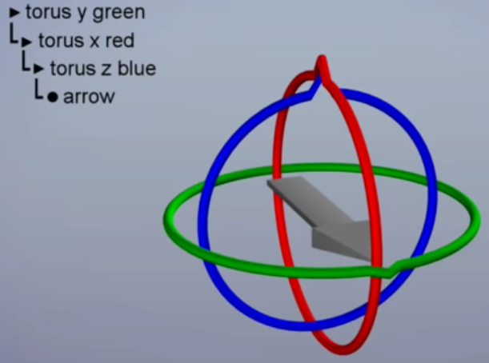
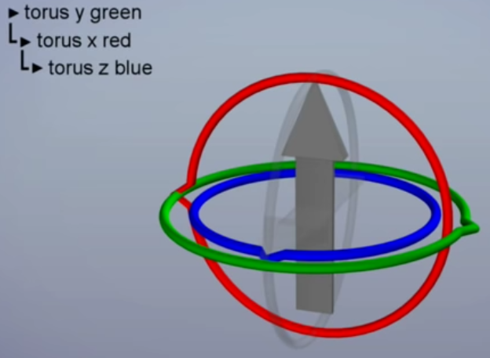
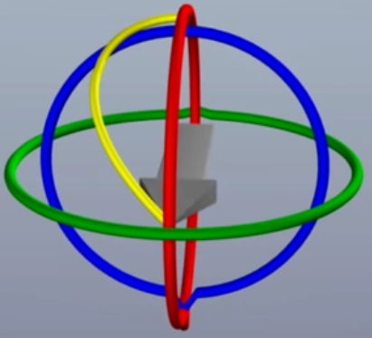

# GuerrillaCG: Gimbal Lock

Notes from [GuerrillaCG's video on gimbal lock in animation](https://www.youtube.com/watch?v=zc8b2Jo7mno).

- [GuerillaCG: Gimbal Lock](#guerillacg-gimbal-lock)
  - [Euler rotation order](#euler-rotation-order)
  - [Gimbal lock](#gimbal-lock)
  - [Solutions](#solutions)
  - [Implementation details](#implementation-details)

## Euler rotation order

Euler rotations rely upon a rotation order, which can be modeled as a hierarchy of gimbals that parent the object. For example, in the the image below the rotation order is `yxz`.

## Gimbal lock

Gimbal lock occurs when the middle gimbal rotates $90\degree$ (ie. the object is rotated $90\degree$ about the middle axis), aligning the outer and inner gimbals in the same plane. In this situation, it impossible to rotate about the inner axis with a single gimbal.

## Solutions

You can achieve the gimbal-locked rotation by moving multiple gimbals at once, but this causes the object to draw an unexpected 3D curve instead of the shortest 2D arc. The object doesn't animate correctly because of unexpected movement between keyframes.

A better solution is to change the rotation order/gimbal hierarchy. This doesn't eliminate gimbal lock, but by picking the optimal rotation order for a specific object we can reduce the odds of it becoming locked.

The goal is for the middle gimbal to be one that is seldom rotated $90\degree$. 

Find: **the direction that the object is least likely to face**.

Ex. Cameras often look side-to-side (rotate about $y$) but seldom look straight up or straight down ($90\degree$ rotation about $x$). Therefore,
- Bad camera rotation orders: `xyz` and `zyx`
- Good camera rotation order: `yxz`

## Implementation details

Note that in some applications (ex. `Maya`) rotation order is written backwards, ex. `zxy` corresponds to the good camera rotation order mentioned above.