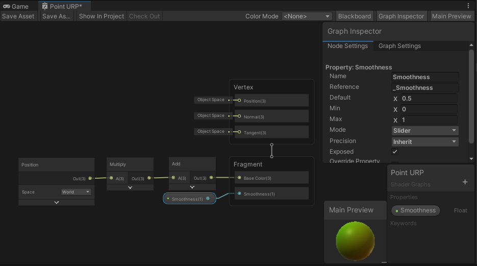

# Shader Graph

Personal notes on writing shaders using Unity's Shader Graph package.

- [Shader Graph](#shader-graph)
  - [Useage](#useage)
  - [Shader Graph Editor](#shader-graph-editor)
    - [Nodes](#nodes)
    - [Properties](#properties)

## Useage

For use with Unity's `Universal Render Pipeline`.

1. Import the `Universal RP` package
2.  Create the `Rendering > Universal Render Pipeline > Pipeline Asset (Forward Renderer)` assets
3. Set `Edit > Project Settings > Graphics > Scriptable Render Pipeline Settings` to the URP asset
4. Create a shader graph: `Assets > Create > Shader > Universal Render Pipeline > Lit Shader Graph`. Double-click the asset to open its editor.
5. **Save edits to the shader graph by clicking `Save Asset`!!!!**

Aside from shader graph, it's also possible to write shaders for the URP, but they are likely to break between URP versions.

## Shader Graph Editor

The editor contains:
- linked nodes representing shader inputs, operations, and outputs,
- a blackboard for creating properties,
- a graph & node inspector, and
- a material preview.

### Nodes

Add nodes by right-clicking an empty space on the graph and selecting `Create Node`.

Compact nodes by clicking the arrows on the bottom (minimize node preview) and top-right (minimize non-node I/O).

### Properties

Create properties in the `blackboard`, configure them in the `inspector`, drag-and-drop them into the graph as `nodes`, and link them to the shader.

To match `.shader` lang conventions, a `Property`'s reference should be set to `_Property`. The property can then be accessed by this reference internally. // TODO what can we do with it? 

