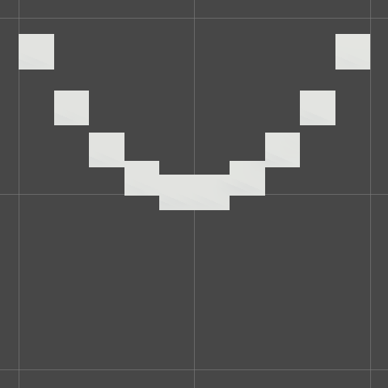

# Graphing

Graphs are visualizations of function behaviour; they which assign input(s) and output(s) to different axes, and then plot points where a function maps input(s) to output(s).

## Scene setup

To view the scene on a notebook-like 2D grid, remove scene effects (ex. skybox) and toggle the view to orthographic. Grid lines are spaced 1 unit apart.

## Build a graph

Visualize a function by vertex location ("point coordinates"). The graph is a Csharp script that uses a `point` prefab to graph points:

- $x$-position determined by the `domain` (min/max $x$-values) and `resolution` (density of points)
- $y = f(x,t)$-position is a function of $x$-position and (optionally) time

## Shade a graph

Visualize a function by fragment shading ("point appearance"). The position-controlling script above determines the `world position` of each point. In the shader program, a vertex position vector can be used to set albedo, for example by setting the red-component with $x$ and the green-component with $y$.

 in Unity")
