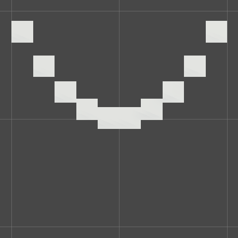

# Catlike Basics

General takeaways from the Catlike Coding Unity basics tutorials

- [Catlike Basics](#catlike-basics)
  - [Visualizing math](#visualizing-math)
    - [Scene setup](#scene-setup)
  - [Shaders](#shaders)
    - [Surface shaders](#surface-shaders)

## Visualizing math

Graphs are visualizations of function behaviour; they which assign input(s) and output(s) to different axes, and then plot points where a function maps input(s) to output(s).

### Scene setup

To view the scene on a notebook-like 2D grid, remove scene effects (ex. skybox) and toggle the view to orthographic. Grid lines are spaced 1 unit apart.

## Shaders

The GPU renders 3D objects by running their shader programs. By writing shaders, we can create materials that use custom math/logic to decide how a point should be visualized.

Shaders are efficient to update. A single material can be assigned to many assets, yet by using the asset properties (ex. location) each asset can be semi-uniquely visualized. When a change in material is needed (ex. restyling a game), we can skip recreating and re-importing every asset's materials, and instead modify a few shaders. Shaders enable:
- Nice materials for small teams who lack the resources to paint textures for each asset,
- Prototyping visual styles (even if the final product contains painted textures),
- Resolution-agnostic materials

Thus, pretty much anything that can be done with a texture or texture-like map is a fair target for shader creation.

Within a shader we can use any of the following properties to determine the rendering of a vertex:
- `position`, world or local. A 3-dimensional vector.
- `albedo`, the spectrum of light diffusely reflected by a surface. A 3-dimensional vector.

### Surface shaders

Surface shaders calculate lighting using adjustable values such as color and glossiness. Unity's standard surface shader only works with the default render pipeline.